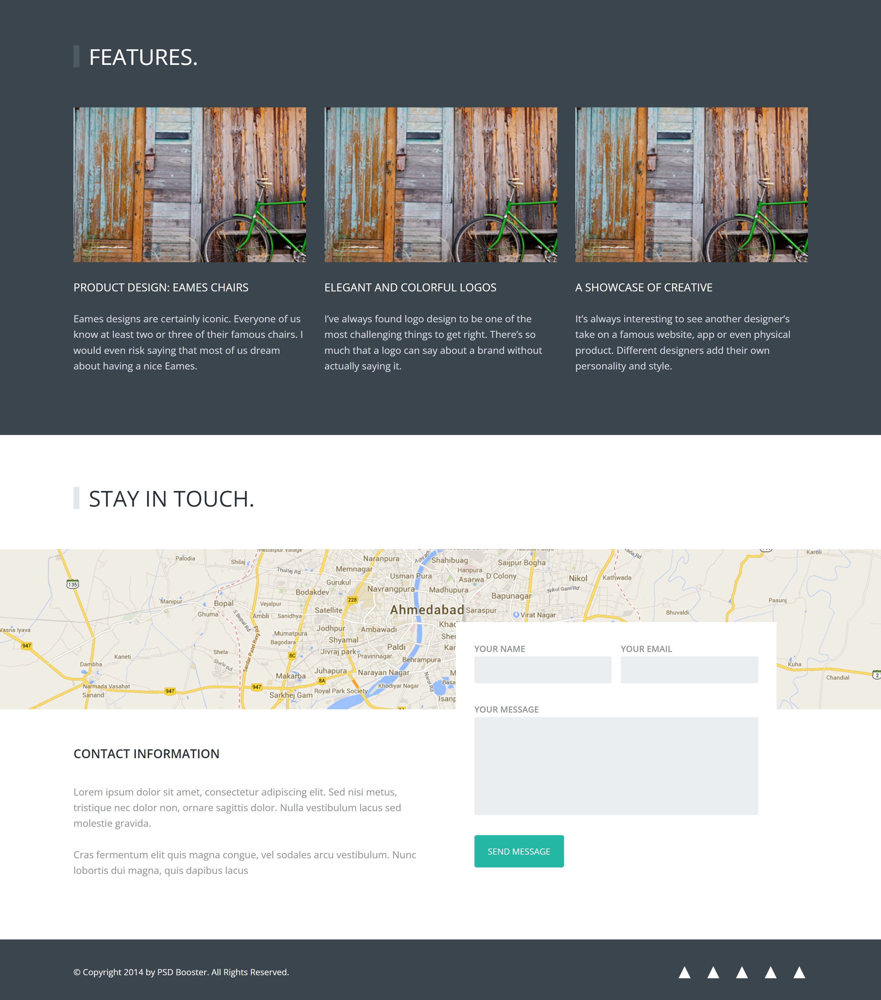
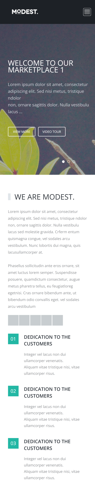
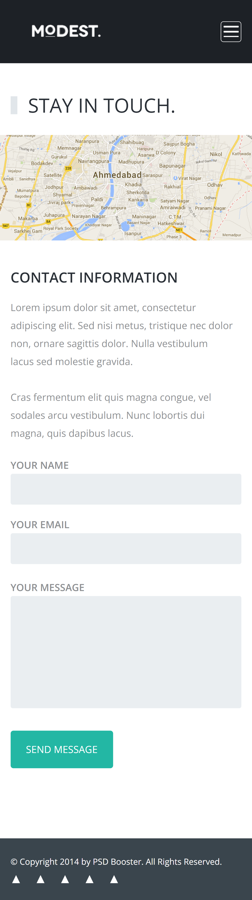

## General info

This project is another one layout of a landing page which has been done according to the psd template from the internet. The project also has been done as a part of educational process using Node.js and different libraries. Also, methodology BEM has been used.

## Technologies

Project is created with:

- Live Sass Compiler - version 3.0.0 (11.07.2018)
- Node.js - version 14.15.2

## Installation

Use
`npm install`
to setup project according to data from package.json

## Screenshots

<!-- Full size view: -->

Mobile view:

